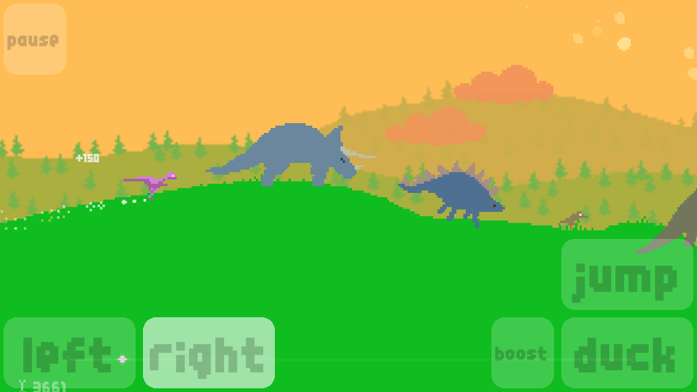

# drdx-stuff
Compile [source](https://github.com/pixeljam/DinoRunDX) for macOS/Windows/iOS/Android. Desktop builds are equivalent to Steam version, mobile are playable but incomplete and likely buggy.



## dependencies
- macOS 13
- WINE (Windows)
- Adobe AIR 32 compiler
- JDK 8 (macOS), 19 (Windows)
- FRESteamworks, Steamworks SDK (desktop)

## license
GPL v3 (derivative work of DinoRunDX).

## run
```zsh
./Build.zsh mac build && cp -R Temp/Build.app ~/Desktop/DRDX_macOS.app
./Build.zsh windows build && cp -R Temp/Build ~/Desktop/DRDX_Windows
./Build.zsh ios build && cp Temp/Build.ipa ~/Desktop/DRDX_iOS.ipa
./Build.zsh android build && cp Temp/Build.apk ~/Desktop/DRDX_Android.apk
```

## builds
See [releases](https://github.com/ASentientBot/drdx-stuff/releases) for sideloadable mobile apps. (For desktop builds, support Pixeljam by purchasing on [Steam](https://store.steampowered.com/app/248330/Dino_Run_DX/) or [itch.io](https://pixeljam.itch.io/dino-run-dx)!)